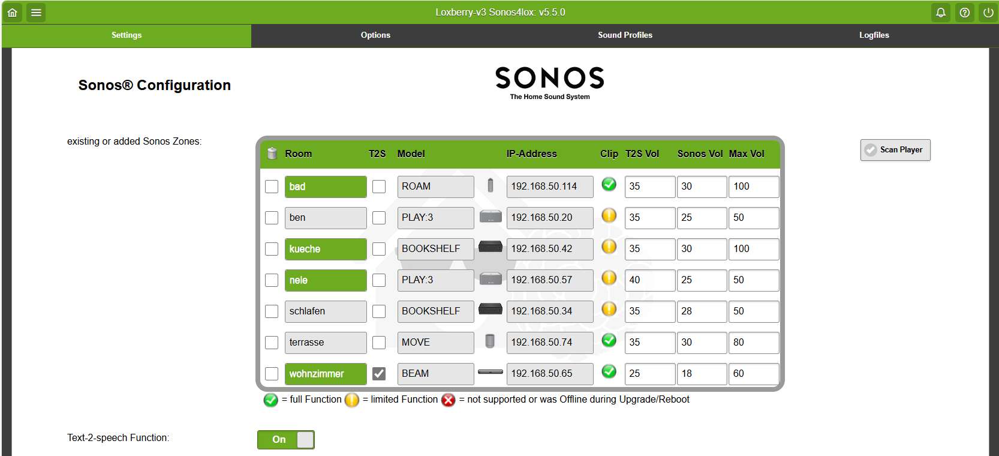
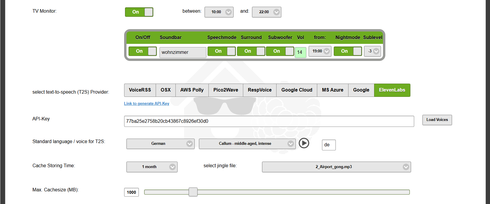
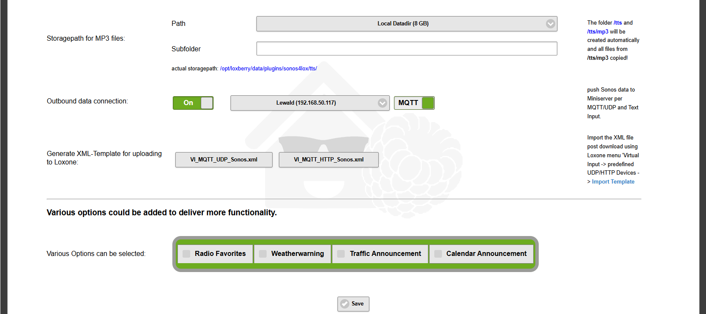

# Sonos Control

Sonos for Smart Home
====================

This Sonos Application is a PHP based library for interacting with [Sonos](http://www.sonos.com/) speakers based on 
[LoxBerry](http://www.loxwiki.eu/display/LOXBERRY/LoxBerry/). The library is a fully maintained including a
wrapper to control your Sonos system from every Smart Home Environment which can handle http GET requests.
The GUI of Loxberry, as well as Sonos Application, is multilingual and could easily be translated in what ever language
you want by using a widget of Loxberry. 

The library contains rigt now nine diff. Text-to-speech Providers:
* MS Azure 
* AWS Polly 
* Google Cloud
* Google Translate 
* Pico2wave
* VoiceRSS 
* ResponsiveVoice
* ElevenLabs 
* MAC OSX 
fitting most likely all languages around the world.
There is no programming experience necessary, just entering some data and clicking through the configuration

To use this library you need to have a minicomputer like Raspberry etc., install the LoxBerry image and then the Sonos Plugin.
Full documentation incl. examples is available at http://www.loxwiki.eu/display/LOXBERRY/Sonos4Loxone  

