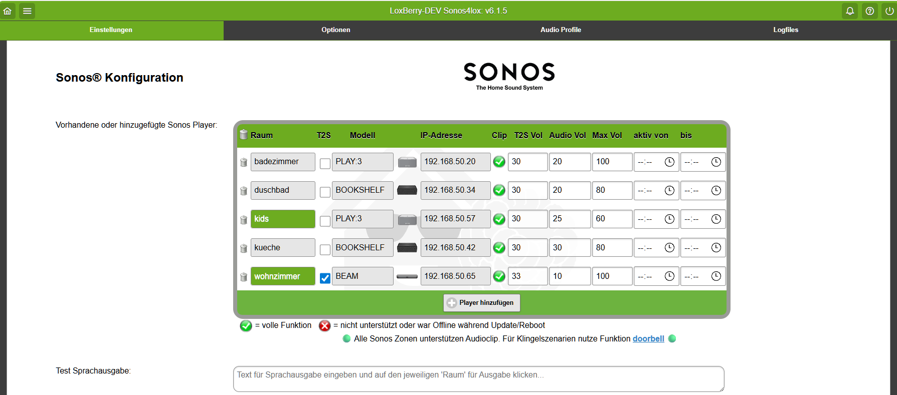
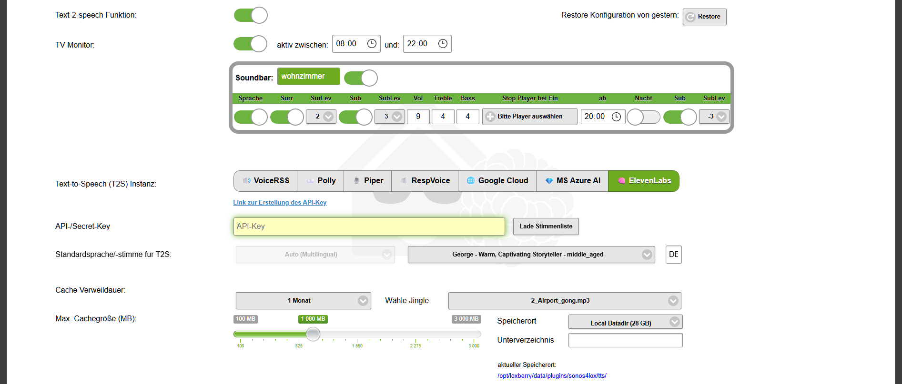
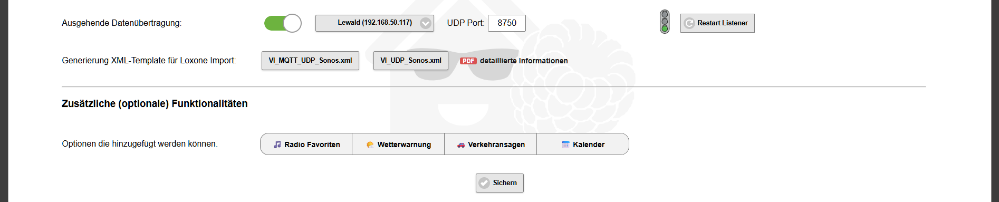
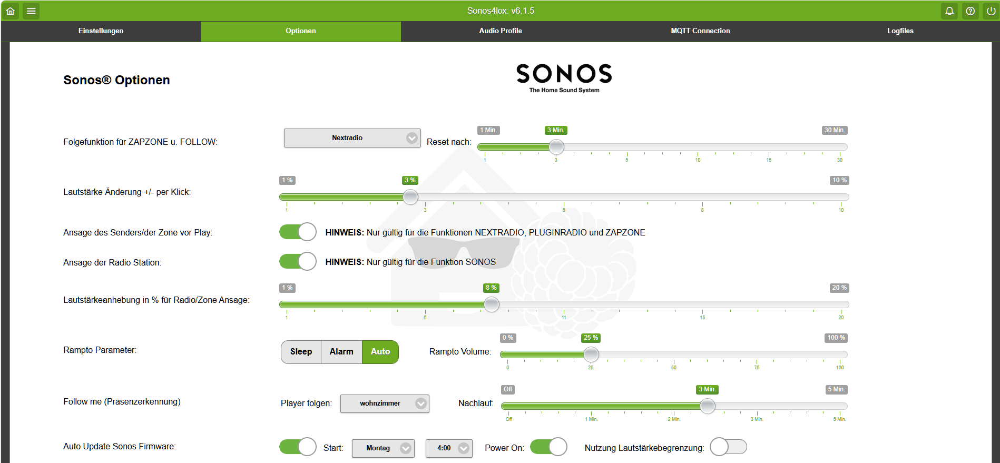
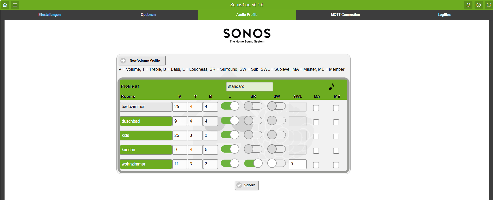

# Sonos for Smart Home

  

## Overview

**Sonos for Smart Home** is a PHP-based LoxBerry plugin for controlling Sonos speakers and integrating them into smart-home environments.

The plugin provides a web interface for configuring and controlling Sonos players and includes an HTTP GET interface that can be used by Loxone and other smart-home systems.

The user interface is multilingual and configuration does not require programming knowledge.

## Main Features

* Control Sonos players from LoxBerry and other smart-home systems
* HTTP GET interface for external control
* Multilingual web interface
* Multiple Text-to-Speech (TTS) providers
* TV Monitor for time-dependent TV audio settings
* MQTT-based outbound player information
* One-click access to your own radio favorites
* Calendar integration for spoken announcements
* One-click functions such as `zapzone`, `nextradio` and `nextdynamic`
* Sonos firmware update support
* Follow-me function based on presence detection
* Sound Profiles for grouped audio settings such as:

  * Volume
  * Bass
  * Treble
  * Loudness
  * Surround
  * Subwoofer and subwoofer level

## Plugin Interface

The plugin provides a graphical configuration interface for managing Sonos players, Text-to-Speech settings and additional smart-home functions.

## Text-to-Speech

The plugin supports several Text-to-Speech providers, allowing spoken announcements to be played through your Sonos system.

Supported providers include:

* **Microsoft Azure** — API key required
* **AWS Polly** — API key required
* **Google Cloud** — API key required
* **Piper** — offline TTS engine
* **VoiceRSS** — API key required
* **ResponsiveVoice**
* **ElevenLabs** — API key required

This provides a wide range of languages, voices and both online and offline TTS options.

## Additional Options

The plugin includes additional automation and convenience functions such as TV audio monitoring, radio favorites, calendar announcements, presence-based follow-me playback and configurable one-click actions.

## Sound Profiles

Sound Profiles make it easy to define and apply audio settings for individual players or groups of players.

Available settings include volume, bass, treble, loudness, surround and subwoofer configuration.

## Requirements

* LoxBerry
* Sonos speakers available on the local network
* A supported LoxBerry system such as Raspberry Pi or x86 hardware

No programming experience is required for normal plugin configuration.

## Documentation

Full documentation, configuration instructions and examples are available in the LoxBerry Wiki:

**[Sonos4Loxone Documentation](https://wiki-loxberry-de.translate.goog/plugins/sonos4loxone/start?_x_tr_sl=de&_x_tr_tl=en&_x_tr_hl=de&_x_tr_pto=wapp)**

General information about LoxBerry:

**[LoxBerry](https://www.loxberry.de/)**

## Support

If you find a bug or have a feature request, please use GitHub Issues:

**[GitHub Issues](https://github.com/Liver64/LoxBerry-Sonos/issues)**

Repository:

**[Liver64/LoxBerry-Sonos](https://github.com/Liver64/LoxBerry-Sonos)**
