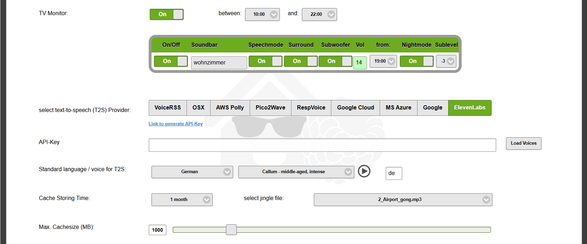
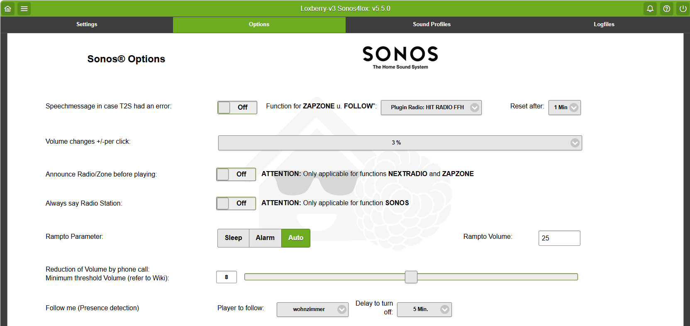
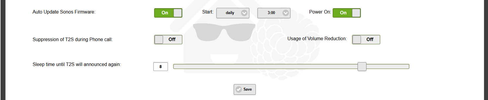
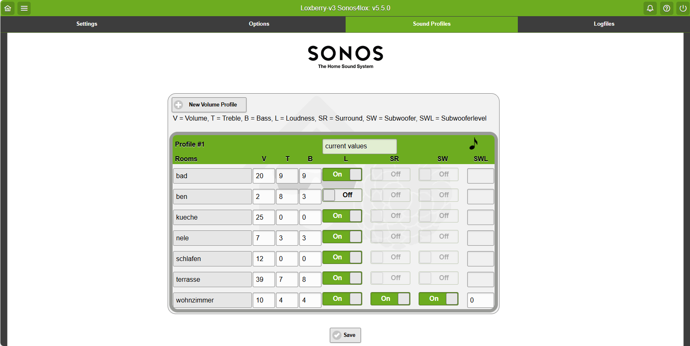

# Control

Sonos for Smart Home
====================

This Sonos Application is a PHP based library for interacting with [Sonos](http://www.sonos.com/) speakers based on 
[LoxBerry](https://wiki-loxberry-de.translate.goog/start?_x_tr_sl=de&_x_tr_tl=en&_x_tr_hl=de&_x_tr_pto=wapp). The library is a fully maintained including a
wrapper to control your Sonos system from every Smart Home Environment which can handle http GET requests.
The GUI of the Sonos Plugin, as well as Loxberry, is multilingual and could easily be translated in what ever language
you want by using a standard widget of Loxberry. 

The library contains rigt now 9 diff. Text-to-speech Providers:
* MS Azure (API key required)
* AWS Polly (API key required)
* Google Cloud (API key required)
* Google Translate 
* Pico2wave
* VoiceRSS (API key required)
* ResponsiveVoice
* ElevenLabs (API key required)
* MAC OSX 

fitting most likely all languages around the world.
For configuration of your Sonos Plugin there is no programming experience necessary, just entering some data and clicking through.

Besides the standard features to Control your Sonos System the Plugin deliver quit a huge amount of additional services:

* 9 different Text-to-Speech Providers
* A TV Monitor to set some time depending TV Sound Audio defaults
* Outbound Data connection to deliver diff. Information for each Player using MQTT Protocol
* Your Own Radio Favorites as endless function (ONE-Click)
* Calendar Integration to speech
* Various ONE-click functions like zapzone, nextradio, nextdynamic, etc.
* Auto Update your Sonos Firmware
* Follow-me function to follow a specific Player through presence detection

* Sound Profiles to set easily various Audio settings for each Player (Volume, Bass, Treble, Loudness, Surround, Subwoofer (-level)

To use this library you need to have a minicomputer like a Raspberry etc., install the LoxBerry image and then the Sonos Plugin.
Full documentation incl. examples is available at [LoxWiki](https://wiki-loxberry-de.translate.goog/plugins/sonos4loxone/start?_x_tr_sl=de&_x_tr_tl=en&_x_tr_hl=de&_x_tr_pto=wapp)

